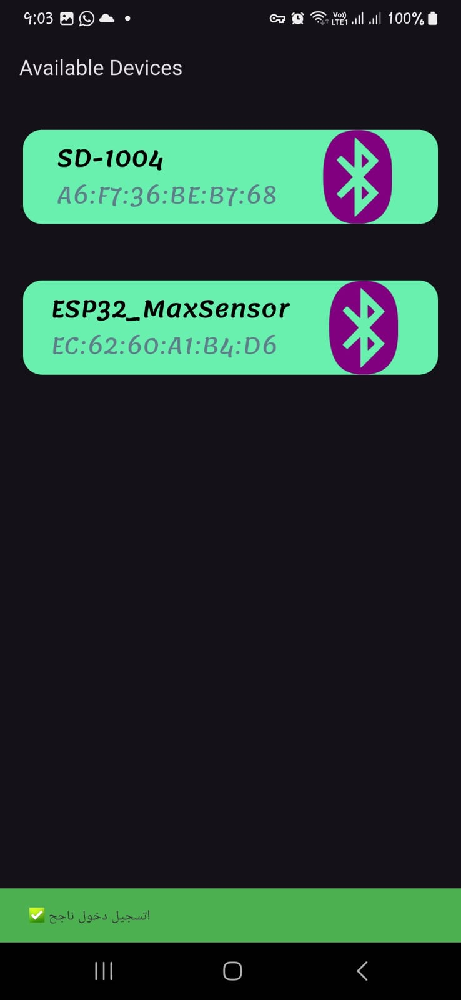
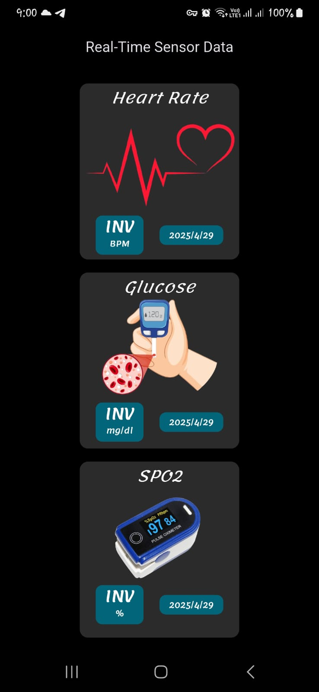
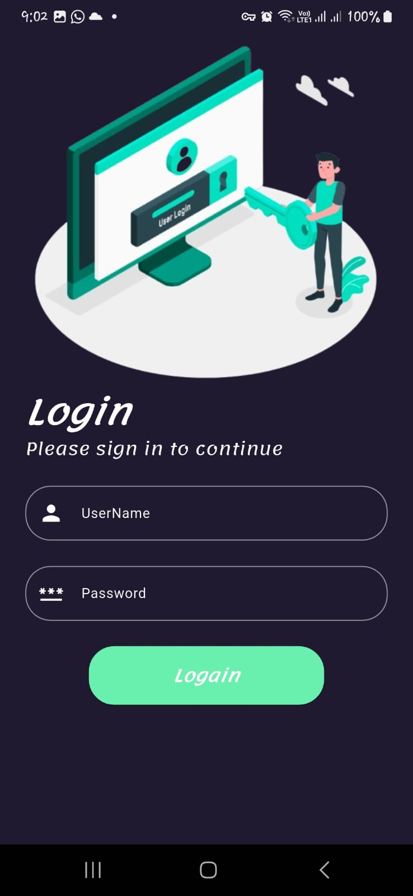

# Flutter BLE Sensor Data App

This Flutter application scans for Bluetooth Low Energy (BLE) devices, connects to a sensor device (like a health monitor), and retrieves real-time health metrics including heart rate, SPO2, and glucose levels. The data is paginated and stored locally using SQLite.

---

## Features

- Scan and list nearby BLE devices
- Connect to sensor devices
- Read heart rate, SPO2, and glucose levels
- Paginated sensor data display
- Store and retrieve data using SQLite
- Uses flutter_blue_plus for BLE operations
- Built using Provider for state management

---

## Preview

### 1. BLE Device Scanning Screen
Shows how the app scans for BLE devices and displays the result.



---

### 2. Sensor Data Display
Displays heart rate, SPO2, and glucose in a list format.



---

### 3. Logain Page
Navigate through different pages of sensor data.



---
### . OnBoarding Page
1. [Page 1 - Introduction](assets/on0.jpg)
2. [Page 2 - Introduction](assets/on1.jpg)
3. [Page 3 - Introduction](assets/on2.jpg)
4. [Page 4 - Introduction](assets/on3.jpg)
5. [Page 5 - Introduction](assets/on4.jpg)
6. [Page 6 - Introduction](assets/on5.jpg)
7. [Page 7 - Introduction](assets/on6.jpg)
8. [Page 8 - Introduction](assets/on7.jpg)


## Folder Structure

```bash
lib/
├── main.dart
├── provider/
│   └── ble_scan_provider.dart
├── screens/
│   └── sensor_data_page.dart
├── services/
│   └── database_helper.dart
└── models/
    └── sensor_data_model.dart